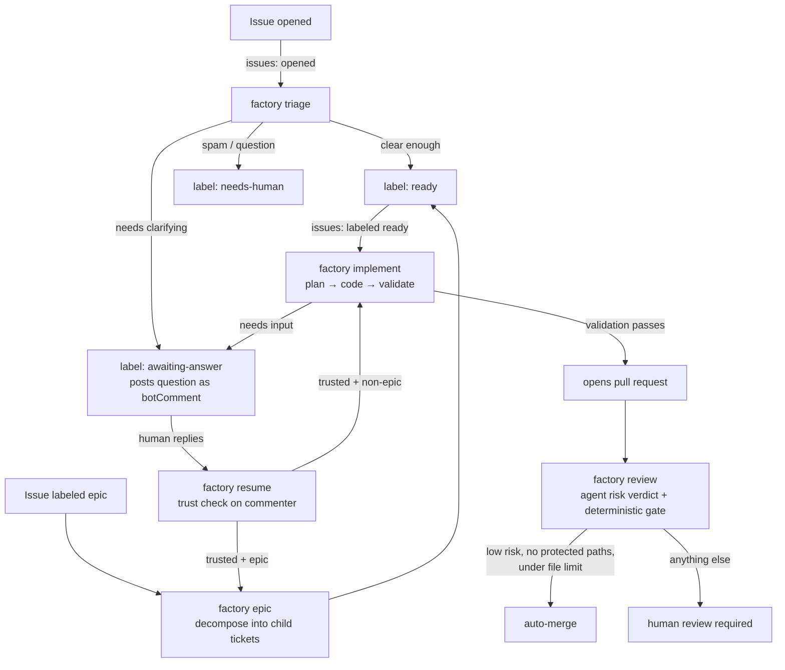

# Factory monorepo

Autonomous issue-to-merge software factory built entirely on GitHub primitives:
**issues** are the work queue (issue forms file the work, labels drive state, comments
carry questions and answers), and **Actions** is the runtime (a reusable workflow
routes issue events to agent jobs — no servers, no webhooks, no external
infrastructure). Open an issue, label it `ready`, and the factory plans, implements,
validates, opens a PR, and merges it if the risk gate passes.

## How it works



The agent proposes; the deterministic gate in `src/lib/gate.ts` disposes — risk level,
protected paths, and file-count limits are code, not model judgment.

## Quick start (consuming repo)

1. Copy `consumer-template/.github/` into your repo (workflow stub + issue forms).
2. Add the `OPENCODE_API_KEY` secret (everything else runs on the workflow's own
   `GITHUB_TOKEN`).
3. In the stub, set the `uses:` ref to the update cadence you want (`@v1` tracks the
   major; `@v1.4.2` freezes).
4. Set any repo-level override variables (see the config table below); org variables
   cover the rest.
5. Add branch protection requiring the `validate` check + one review for
   non-auto-merged PRs.
6. Open an issue using the **Ticket** form, label it `ready` — the factory plans,
   implements, validates, opens a PR, and auto-merges it if the risk gate passes.

What stays per-repo, and why: `validate.yml` (runs the *consuming* repo's own
`pnpm verify` — the factory can't know your build; it's the required status check), the
issue forms (committed so they render in the issue chooser — re-copy from
`consumer-template/` on the rare form update, or add a scheduled sync workflow once
you're past ~10 repos), the optional `factory-comment.yml` (`/oc` interface), and the
optional `.github/actions/factory-setup` action (build-time setup — see below).

```yaml
# .github/workflows/factory.yml — the entire per-repo footprint
jobs:
  factory:
    uses: rlweb/a-factory/.github/workflows/factory.reusable.yml@v1
    secrets:
      OPENCODE_API_KEY: ${{ secrets.OPENCODE_API_KEY }}
    with:
      event_name: ${{ github.event_name }}
      # ...event context, see consumer-template/.github/workflows/factory.yml
```

## What each entry point does

### Ticket / Bug — the main path

Both forms feed the same pipeline; which one you pick changes how the work is done.

| Form | Labels applied | Implemented by | "Automation intent" default |
| --- | --- | --- | --- |
| **Ticket / feature** | `ticket`, `triage` | `builder` — implement end to end | attempt implementation if low risk |
| **Bug report** | `bug`, `triage` | `bugfixer` — reproduce first, minimal diff, regression test | **triage only** |
| **Epic** | `epic`, `triage` | `decomposer` — split into child tickets, no code | decompose automatically |

Note the differing defaults: a ticket is queued for automated work by default, a bug
is not. That's deliberate — you usually want eyes on a defect before an agent changes
behaviour — so flip **Automation intent** to "attempt auto-fix if low risk" on a bug
you're happy to hand over. Nothing is implemented unless that field says so *and*
triage judges the request concrete enough.

What happens next: triage classifies the issue and applies labels; if it's actionable
it adds `ready`, which starts the build. The build plans first (read-only), then
implements, then runs `pnpm verify` — retrying up to `FACTORY_VALIDATION_ATTEMPTS`
times, feeding each failure back to the agent. On success it opens a PR and the review
gate decides auto-merge vs human. On failure it labels `needs-human` and pushes the
branch for you to inspect.

Write **acceptance criteria** as a real checklist: the agent treats each line as a
requirement, and the reviewer scores the diff against them as the spec.

If the planner finds something materially ambiguous it stops *before* touching code,
comments its questions, and labels the issue `awaiting-answer` — see Comments below.

### Epic — decomposed into tickets

Use an Epic when the work is too big for one ticket. The factory reads the objective,
in/out of scope, your optional suggested breakdown, and any human answers in the
issue thread, then splits it into child
tickets that are independently shippable and sized to a single agent session, wiring
dependency edges only where ordering genuinely matters.

The epic form has two settings, and they do different jobs. **Automation intent** decides
whether decomposition runs at all — flip it to "triage only" to hold the epic for a human.
Decomposition itself writes no code, so unlike a ticket or bug it defaults to on.
**Decomposition intent** decides what decomposition does with its result:

| Mode | Behaviour |
| --- | --- |
| `propose` (default) | Posts the breakdown as a comment, labels the epic `awaiting-answer`, and creates nothing until you approve. |
| `auto` | Creates each child ticket immediately. Children with no dependencies are labelled `ready` and dispatched; dependents are labelled `blocked`. |

**Approving a proposed breakdown.** Reply on the epic with `approve` (or `approved`,
`lgtm`, `go ahead`, `ship it`, `/approve`) as the **first line** of your comment, and the
child tickets are created. Reply with anything else and it's treated as revision feedback:
the epic re-decomposes with your comment in context and proposes again, looping until you
approve.

Approval is anchored to the start of the comment on purpose — a substring match would read
"I don't approve of splitting T2 that way" as consent. A negation on that line vetoes it,
and quoted (`>`) lines are skipped so replying above a quoted proposal works.

The approved plan is embedded in the breakdown comment as a hidden base64 block, and
approval replays it **verbatim with no model call**. That matters: prompting the decomposer
twice does not give the same answer twice (one epic went 4 subtasks, then 3), so without
this the tickets you got wouldn't be the ones you approved. If a plan is too large to fit
in a comment the factory says so, and approving re-plans from scratch instead.

Precedence for the mode is most-specific-first: an `approve` comment beats the epic's
**Decomposition intent** dropdown (you chose that before seeing the breakdown), which beats
the repo-wide `FACTORY_DECOMPOSE_MODE` variable, which beats the baked default of `propose`.
An unrecognised value at any level falls through to `propose` rather than guessing — `auto`
is the branch that opens issues and dispatches builds unattended.

Note that nothing yet promotes a `blocked` child when its prerequisites merge; add `ready`
yourself and the build starts.

### Comments — answering the agent, and ad-hoc `/oc`

Two separate mechanisms:

**Answering a question** (issue comments only). Triage (clarifying questions on vague
issues), implement (ambiguous plans), and epic decomposition (a breakdown awaiting
approval) all post `awaiting-answer` questions. A reply resumes the work — for an epic,
into either ticket creation or another proposal round, per Epic above. Who can resume is
governed by
`FACTORY_TRUSTED_ASSOCIATIONS`: an OWNER, MEMBER, or COLLABORATOR resumes immediately;
anyone else has their answer accepted but held until a maintainer 👍s the comment or
adds the `answer-approved` label. The factory ignores its own comments (marked with
an HTML comment sentinel), so its questions never re-trigger it. This path does not
apply to PR comments.

**`/oc` or `/opencode`** in any issue or pull request comment runs an ad-hoc agent via
the optional `factory-comment.yml` (the official OpenCode action, not the factory
orchestrators). There's no triage, no risk gate, and no verify loop — it's the "just do
this one thing" escape hatch, handy for acting on review feedback on a factory PR.

## What's here

```
action.yml                   composite action: builds the package and runs the CLI
src/                         orchestrators, lib, CLI bin, index (tests colocated as *.test.ts)
agents/                      vendored agent prompts (mattpocock/skills, MIT)
.github/workflows/
  factory.reusable.yml       the central reusable workflow consumers call
consumer-template/           what each consuming repo commits
  .github/workflows/         thin stub + validate + comment
  .github/ISSUE_TEMPLATE/    the forms
```

## The distribution model

Logic ships as a **composite GitHub Action** (`uses: rlweb/a-factory@main` — built from
this repo on the runner, nothing published to npm); CI ships as a **reusable workflow**
called by a thin per-repo stub pinned to a version ref; issue forms are **committed per
repo** from the template; config lives in **GitHub Actions variables** (org baseline,
repo overrides). One git ref versions the lot.

| Piece | Lives in | Distributed as | Versioned by |
| --- | --- | --- | --- |
| Orchestrator logic | `action.yml` + `src/` | composite action (`uses: rlweb/a-factory@main`) | git ref |
| CI workflows | `.github/workflows/factory.reusable.yml` | reusable workflow (`uses:`) | git ref (`@v1`, `@v1.4.2`) |
| Issue forms | `consumer-template/` | committed per repo | copied at onboarding |
| Config | Actions variables | org/repo vars | GitHub UI (not versioned) |

Workflows can't live in an action — GitHub only runs workflow YAML from the repo's own
`.github/`. Hence the action/workflow split; when a job runs `uses: rlweb/a-factory@<ref>`,
GitHub downloads this repo's tree at that ref and the action builds the package
in place.

## Agents per issue type

Each phase runs a purpose-built OpenCode agent. `builder` (implement), `bugfixer`
(diagnosing-bugs, for `bug`-labelled issues), and the `tdd` subagent the builder
delegates to use prompts vendored verbatim from
[mattpocock/skills](https://github.com/mattpocock/skills) (MIT, see `agents/LICENSE`),
behind a shared harness preamble that adapts them to unattended CI (no human to ask,
no self-committing, dangling skill references skipped). `reviewer` and `decomposer`
use factory-written prompts distilled from those skills' ideas (the two-axis review +
smell baseline; one-shot shippable decomposition). `planner`, `triager`, `reviewer`,
and `decomposer` are read-only by permission (`edit: deny`), not just by prompt.

### Configure via your repo's `opencode.json`

The model is **not** an Actions variable — it comes from the consuming repo's
`opencode.json`, which OpenCode loads natively. **Setting a default model there is
highly recommended**; without one the factory falls back to a baked default
(`mini-v2.5`), which may not match your provider setup:

```json
{
  "model": "mini-v2.5"
}
```

The same file can override any factory agent — define an agent with the same name
(`builder`, `bugfixer`, `reviewer`, `decomposer`, `planner`, `triager`, `tdd`) and the
factory's baked definition is dropped entirely in favour of yours. That's a wholesale
replacement (prompt, model, permissions), so restate whatever you want to keep. For
example, a cheaper model for triage and a house-style builder:

```json
{
  "model": "mini-v2.5",
  "agent": {
    "triager": {
      "model": "anthropic/claude-haiku-4-5",
      "prompt": "You triage GitHub issues for an automated implementation factory. Be conservative.",
      "permission": { "edit": "deny", "bash": "deny" }
    },
    "builder": {
      "prompt": "Implement the ticket end to end. Follow CONTRIBUTING.md. Prefer small diffs."
    }
  }
}
```

Keep the file **strict JSON** (the name says `.json`, and the factory parses it
strictly) — if it can't be parsed, the factory logs a notice and behaves as if it were
absent, which would put the baked defaults back in charge.

## Config is variables, not files

Every tunable is a `vars.*` Actions variable (**Settings ▸ Secrets and variables ▸
Actions ▸ Variables**) resolved by GitHub as repo > org > baked default. Set the shared
baseline once as org variables; override per repo only where needed. Unset reads as
empty-string and falls back to the default — the parsing in `src/lib/config.ts` handles
that explicitly (and is unit-tested in `src/lib/config.test.ts`, because `Number("")===0`
would otherwise silently zero a limit).

| Variable | Type | Default | Meaning |
| --- | --- | --- | --- |
| `FACTORY_VALIDATION_ATTEMPTS` | number | `3` | Self-fix loops before human handoff |
| `FACTORY_QUESTION_ROUNDS` | number | `0` | Eager-question round cap (`0` = uncapped) |
| `FACTORY_GATE_MAX_FILES` | number | `20` | Files-changed ceiling for auto-merge |
| `FACTORY_PROTECTED_PATHS` | comma-separated | `.github/**,infra/**,**/migrations/**,**/*.tf,src/auth/**,package.json,pnpm-lock.yaml,package-lock.json` | Globs that force human review |
| `FACTORY_TRUSTED_ASSOCIATIONS` | comma-separated | `OWNER,MEMBER,COLLABORATOR` | author_association levels that resume immediately |
| `FACTORY_SERVER_TIMEOUT_MS` | number | `15000` | OpenCode server boot timeout |
| `FACTORY_DECOMPOSE_MODE` | `propose` \| `auto` | `propose` | Repo-wide epic decomposition default. An epic's "Decomposition intent" field wins over it, and an `approve` comment wins over both |

Encoding notes:

- Comma-separated variables split on `,` and trim; blank segments drop (`a,,b,` →
  `["a","b"]`). Globs use `minimatch` with `dot: true`, so `.github/**` matches
  dotfile paths.
- You cannot set a list variable to *empty* — `""` reads as unset and restores the
  default, so an accidental blank can't silently disable a safety default. If you truly
  need an empty list, set a sentinel the code won't match (and open an issue — that's a
  config smell).

The only secret is `OPENCODE_API_KEY`; everything else runs on the workflow's own
`GITHUB_TOKEN`.

### Repo setup before builds (deps, caches, Playwright)

If the agent's validation needs anything installed — dependencies, browsers,
toolchains — commit a local composite action at
`.github/actions/factory-setup/action.yml` in the consuming repo. The factory's build
job detects it and runs it in your checkout before the agent starts; absent, the step
is skipped silently. Because it's a composite action it can use real workflow steps,
including `actions/cache`:

```yaml
# .github/actions/factory-setup/action.yml
name: factory setup
runs:
  using: composite
  steps:
    - uses: actions/cache@v4
      with:
        path: ~/.cache/ms-playwright
        key: playwright-${{ runner.os }}-${{ hashFiles('pnpm-lock.yaml') }}
    - run: corepack enable && pnpm install --frozen-lockfile
      shell: bash
    - run: pnpm exec playwright install --with-deps chromium
      shell: bash
```

Two things to know: every `run:` step in a composite action must declare an explicit
`shell:`, and the job's `GITHUB_TOKEN` (also as `GH_TOKEN`) is in the environment, so
your setup can authenticate against private registries or use the `gh` CLI.

## Develop

```bash
pnpm install
pnpm run verify        # biome check + typecheck + test
pnpm run build         # emit dist/ (ESM + .d.ts)
```

## Future updates

Planned, not yet built:

- **MCP auth support** — let consumer repos declare MCP servers (via `opencode.json`'s
  `mcp` block) with credentials passed through as workflow secrets, so factory agents
  can reach tools like issue trackers, docs, or internal APIs during a run.
- **Configurable verify command** — the verification loop currently hardcodes
  `pnpm verify`; make the command per-repo configurable (likely a
  `FACTORY_VERIFY_COMMAND` variable) so non-pnpm and non-Node repos can consume the
  factory.
- **Factory-specific skills** — a way for a consumer repo to add its own skill/prompt
  files (e.g. `.factory/skills/*.md`) that get appended to the relevant agents'
  context, so house rules ride alongside the vendored skills without redefining whole
  agents in `opencode.json`.
